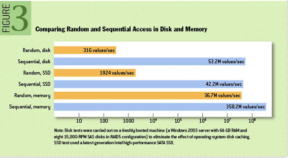
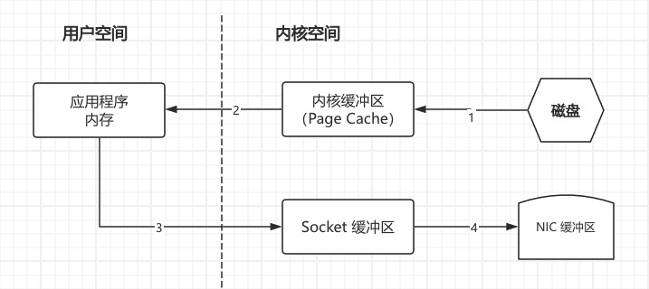

> 它需要优雅地处理大量的数据积压，以便能够支持来自脱机系统的定期数据加载。Kafka Design
>
> Kafka 设计

# 1. 动机

我们设计Kafka是为了能够作为一个统一的平台来处理所有的实时数据馈送 [a large company might have](https://kafka.apache.org/documentation/#introduction)。要做到这一点，我们必须考虑相当广泛的用例集。

它**必须具有高吞吐量以支持大容量事件流**，例如实时日志聚合。

它需要**优雅地处理大量的数据积压**，以便能够支持来自脱机系统的定期数据加载。

这也意味着系统**必须处理低延迟交付**，以处理更传统的消息传递用例。

我们希望支持对这些提要进行分区、分布式和实时处理，以创建新的派生提要。这**激发了我们的分区和消费者模型**。

最后，在将流输入到其他数据系统中进行服务的情况下，我们知道系统必须能够**保证在出现机器故障时的容错性**。

支持这些用途使我们的设计具有许多独特的元素，更类似于数据库日志而不是传统的消息传递系统。

我们将在下面的部分中概述该设计的一些元素。

# 2. 持久性

> [ACM Queue article](https://queue.acm.org/detail.cfm?id=1563874) 需要回看

## 不要害怕文件系统！

Kafka 很大程度上依赖于文件系统来存储和缓存消息。人们普遍认为“磁盘很慢”，这使人们怀疑持久结构能否提供有竞争力的性能。实际上，根据使用方式的不同，磁盘的速度比人们预期的要慢得多，也要快得多；一个设计合理的磁盘结构通常可以和网络一样快。

关于磁盘性能的一个关键事实是，在过去十年中，硬盘驱动器的吞吐量与磁盘查找的延迟一直在偏离。因此，在一个由六个 7200 转 SATA 硬盘组成的 RAID-5 阵列的 [JBOD](https://en.wikipedia.org/wiki/Non-RAID_drive_architectures)（Just a Bunch Of Disks，即一堆独立磁盘）配置中，线性写入的性能约为600MB/秒，而随机写入的性能仅为约100k/秒——两者之间的差异超过了6000倍。这些线性读写是所有使用模式中最可预测的，并且由操作系统进行了大量优化。现代操作系统提供了预读和后写技术，这些技术以大块的倍数预取数据，并将较小的逻辑写分组为较大的物理写。关于这个问题的进一步讨论可以在 **[ACM Queue article](https://queue.acm.org/detail.cfm?id=1563874)** 中找到；他们实际上发现在某些情况下，顺序磁盘访问可能比随机内存访问更快！如下所示：

为了弥补这种性能差异，现代操作系统越来越积极地使用主存进行磁盘缓存。一个现代的操作系统会很高兴地将所有空闲内存转移到磁盘缓存中，而在内存回收时几乎没有性能损失。所有磁盘读写都将通过这个统一缓存。在不使用直接 I/O 的情况下，这个特性不容易关闭，所以即使一个进程维护了数据的进程内缓存，这个数据也可能会在操作系统页面缓存中复制，从而有效地将所有内容存储两次。

此外，我们是在 JVM 之上构建的，任何花时间研究 Java 内存使用的人都知道两件事：

1. 对象的内存开销非常高，通常是存储数据大小的两倍（甚至更糟）。
2. 随着堆内数据的增加，Java 垃圾收集变得越来越繁琐和缓慢。

由于这些因素，使用文件系统并依赖于 pagecache 要优于维护内存缓存或其他结构 —— 通过自动访问所有空闲内存，我们至少可以将可用缓存增加一倍，并且通过存储紧凑的字节结构而不是单个对象，可能会再次增加一倍。这样做将在32GB的机器上产生28-30GB的缓存，而不会产生GC惩罚。此外，即使服务重新启动，这个缓存也将保持温暖，而进程内缓存需要在内存中重建（对于10GB的缓存可能需要10分钟），否则它将需要从一个完全冷的缓存开始（这可能意味着糟糕的初始性能）。这也极大地简化了代码，因为维护缓存和文件系统之间一致性的所有逻辑现在都在操作系统中，这往往比一次性的进程内尝试更有效、更正确。如果您的磁盘使用情况倾向于线性读取，那么预读就是在每次读取磁盘时用有用的数据有效地预先填充这个缓存。

这暗示了一种非常简单的设计：与其在内存中维护尽可能多的内存，并在空间用完时恐慌地将其全部刷新到文件系统中，不如将其颠倒过来。所有数据都立即写入文件系统上的持久日志，而不必刷新到磁盘。实际上，这只是意味着它被转移到内核的页面缓存中。

这种以页面缓存为中心的设计风格在一篇关于Varnish设计的 [article](https://varnish-cache.org/wiki/ArchitectNotes) 中有描述（同时也有一些傲慢）。

## 常数时间满足

消息传递系统中使用的持久数据结构通常是每个消费者的队列，具有关联的 BTree 或其他通用随机访问数据结构，用于维护有关消息的元数据。BTrees 是可用的最通用的数据结构，使得在消息传递系统中支持各种各样的事务性和非事务性语义成为可能。不过，它们的成本也相当高：Btree 的操作是O(log N)。通常情况下，O(log N) 被认为本质上等同于常数时间，但对于磁盘操作来说并非如此。磁盘查找的速度为每次10毫秒，并且每个磁盘一次只能执行一次查找，因此并行性是有限的。因此，即使少量的磁盘搜索也会导致非常高的开销。由于存储系统混合了非常快的缓存操作和非常慢的物理磁盘操作，因此观察到的树结构的性能通常是超线性的，因为数据增加了固定的缓存 —— 也就是说，数据量翻倍会导致速度比翻倍还要慢。

直观地说，持久队列可以建立在简单的读取和追加文件的基础上，这是日志解决方案中常见的情况。这种结构的优点是所有操作都是0(1)，读操作不会阻塞写操作，也不会相互阻塞。这具有明显的性能优势，因为性能与数据大小完全解耦 —— 一台服务器现在可以充分利用许多便宜、低转速的1+TB SATA驱动器。虽然它们的寻道性能很差，但这些驱动器具有可接受的大读写性能，并且价格为1/3，容量为 3 倍。

在没有任何性能损失的情况下访问几乎无限的磁盘空间意味着我们可以提供消息传递系统中通常没有的一些特性。例如，在 Kafka 中，我们可以保留消息相对较长的一段时间（比如一周），而不是试图在消息被消耗后立即删除消息。这为消费者带来了很大的灵活性，我们将对此进行描述。

# 3. 效率

我们在提高效率方面下了很大的功夫。我们的主要用例之一是处理网络活动数据，这是非常大的量：每个页面视图可能产生几十个写。此外，我们假设发布的每条消息至少被一个（通常是多个）消费者读取，因此我们努力使消费尽可能便宜。

我们还从构建和运行许多类似系统的经验中发现，效率是有效的多租户操作的关键。如果下游基础设施服务很容易因为应用程序使用的小变化而成为瓶颈，那么这种小的变化通常会产生问题。通过非常快的速度，我们帮助确保应用程序将在基础设施之前在负载下翻转。当试图在集中式集群上运行支持数十或数百个应用程序的集中式服务时，这一点尤其重要，因为使用模式几乎每天都会发生变化。

我们在前一节中讨论了磁盘效率。一旦消除了不良的磁盘访问模式，这种类型的系统就会出现**两个常见的低效率原因**：

- 太多的小I/O操作
- 过多的字节复制。

小的 I/O 问题既发生在客户机和服务器之间，也发生在服务器自己的持久操作中。

为了避免这种情况，我们的协议是围绕“消息集”抽象构建的，该抽象自然地将消息分组在一起。这允许网络请求将消息分组在一起，并分摊网络往返的开销，而不是一次发送一条消息。反过来，服务器一次将消息块附加到其日志中，而消费者一次获取大的线性块。

这个简单的优化产生了数量级的速度提升。批处理导致更大的网络数据包，更大的顺序磁盘操作，连续的内存块等等，所有这些都允许Kafka 将随机消息写入的突发流转换为流向消费者的线性写入。

另一个低效率是字节复制。在低消息速率下，这不是问题，但在负载下影响很大。为了避免这种情况，我们采用了由生产者、代理和消费者共享的标准化二进制消息格式（因此数据块可以在它们之间传输而无需修改）。

代理维护的消息日志本身只是一个文件目录，每个目录由一系列消息集填充，这些消息集已以生产者和消费者使用的相同格式写入磁盘。维护这种通用格式可以优化最重要的操作：持久日志块的网络传输。现代 unix 操作系统为将数据从 pagecache 传输到套接字提供了高度优化的代码路径；在Linux中，这是通过 [sendfile system call](https://man7.org/linux/man-pages/man2/sendfile.2.html) 完成的。

为了理解 sendfile 的影响，理解从文件到套接字传输数据的通用数据路径是很重要的：

1. 操作系统将数据从磁盘读入内核空间中的 pagecache
2. 应用程序将数据从内核空间读入用户空间缓冲区
3. 应用程序将数据写回内核空间到套接字缓冲区中
4. 操作系统将数据从套接字缓冲区复制到通过网络发送的NIC缓冲区

这显然是低效的，有四个副本和两个系统调用。通过使用 sendfile，允许操作系统将数据从 pagecache 直接发送到网络，从而避免了这种重复复制。因此，在这个优化的路径中，只需要对 NIC 缓冲区进行最后的复制。

我们期望一个常见的用例是一个主题上的多个消费者。使用上面的零复制优化，数据只被复制到 pagecache 中一次，并在每次使用时重用，而不是存储在内存中，并在每次读取时将其复制到用户空间。这允许以接近网络连接限制的速率使用消息。

pagecache 和 sendfile 的结合意味着，在 Kafka 集群中，消费者大多被赶上，你将看不到磁盘上的任何读取活动，因为它们将完全从缓存中提供数据。

TLS/SSL 库在用户空间中运行（内核中的 `SSL_sendfile` 目前不受 Kafka 支持）。由于这一限制，当启用 SSL 时不会使用 `sendfile`。有关启用 SSL 配置的详细信息，请参阅 `security.protocol` 和 `security.inter.broker.protocol`。

有关 Java 中 **sendfile** 和**零拷贝**支持的更多背景信息，请参阅本文 [article](https://developer.ibm.com/articles/j-zerocopy/)。

## 端到端批量压缩

在某些情况下，瓶颈实际上不是CPU或磁盘，而是网络带宽。对于需要在广域网上的数据中心之间发送消息的数据管道来说尤其如此。当然，用户总是可以一次压缩一个消息，而不需要Kafka的任何支持，但这可能导致非常低的压缩比，因为许多冗余是由于相同类型的消息之间的重复（例如 JSON 中的字段名或 web 日志中的用户代理或常见字符串值）。**有效的压缩需要将多个消息压缩在一起，而不是单独压缩每个消息。**

Kafka通过高效的批处理格式支持这一点。可以将一批消息分组、压缩并以这种形式发送到服务器。broker 将对批处理进行解压缩以验证它。例如，它验证批处理中的记录数是否与批头所声明的记录数相同。然后将这批消息以压缩形式写入磁盘。该批将在日志中保持压缩，并以压缩形式传输给消费者。消费者解压缩它接收到的任何压缩数据。

Kafka 支持 GZIP、 Snappy、LZ4 和 ZStandard 压缩协议。更多关于压缩的细节可以在 [here](https://cwiki.apache.org/confluence/display/KAFKA/Compression) 找到。

# 4. 生产者

## 负载均衡

生产者直接将数据发送给作为分区领导者的代理，中间没有任何路由层。为了帮助生产者完成这一点，所有的 Kafka 节点都能够响应关于哪些服务器是活跃的以及在任何给定时间主题的分区领导者在哪里的元数据请求，这样生产者就能够适当地定向其请求。

客户端控制将消息发布到哪个分区。这可以随机完成，实现一种随机负载平衡，也可以通过一些语义划分功能来完成。我们通过允许用户指定一个用于分区的键，并使用该键进行哈希到某个分区来暴露语义分区的接口（如果需要的话，也可以选择覆盖分区函数）。例如，如果选择的键是一个用户id，那么给定用户的所有数据将被发送到同一个分区。反过来，这将允许消费者对他们的消费做出本地假设。这种分区方式是专门设计用来允许消费者进行位置敏感处理的。

## 异步发送

批处理是效率的一大驱动因素，为了实现批处理，Kafka生产者将尝试在内存中积累数据，并在单个请求中发送更大的批处理。可以将批处理配置为累积不超过固定数量的消息，并且等待时间不超过某个固定的延迟范围（例如 64k 或 10 ms）。这允许累积更多要发送的字节，并且在服务器上很少进行较大的I/O操作。这种缓冲是可配置的，并且提供了一种机制来权衡少量的额外延迟以获得更好的吞吐量。

关于 [configuration](https://kafka.apache.org/documentation/#producerconfigs) 和 [api](https://kafka.apache.org/082/javadoc/index.html?org/apache/kafka/clients/producer/KafkaProducer.html) 的详细信息可以在文档的其他地方找到。

# 5. 消费者

Kafka 消费者通过向引导它想要消费的分区的代理发出 “fetch” 请求来工作。消费者在每个请求中指定其在日志中的偏移量，并从该位置开始接收回一个日志块。因此，消费者对该位置具有重要的控制权，并且可以在需要时倒回以重新消费数据。

## 推 vs 拉

我们最初考虑的一个问题是，消费者应该从代理中提取数据，还是代理应该将数据推送给消费者。在这方面，Kafka 遵循了大多数消息传递系统共享的更传统的设计，其中**数据从生产者推送到代理**，并由**消费者从代理中提取**。一些以日志为中心的系统，如 [Scribe](https://github.com/facebook/scribe) 和 [Apache Flume](https://flume.apache.org/)，遵循一种非常不同的基于推送的路径，将数据向下推送。这两种方法各有利弊。然而，基于推送的系统很难处理不同的消费者，因为代理控制数据传输的速率。目标通常是让消费者能够以最大可能的速度消费；不幸的是，在推送系统中，这意味着当消费者的消费速度低于生产速度（本质上是拒绝服务攻击）时，消费者往往会不堪重负。基于拉动的系统具有更好的属性，即消费者只是落后并在可能的情况下赶上。这可以通过某种 backoff 协议来缓解，通过这种协议，消费者可以表明它已经不堪重负，但是要充分利用（但不要过度利用）消费者的传输速率比看起来要棘手得多。以前以这种方式构建系统的尝试导致我们**使用更传统的拉动模型**。

基于拉的系统的**另一个优点是，它可以将数据批量发送给用户**。基于推送的系统必须选择立即发送请求或积累更多数据，然后在不知道下游使用者是否能够立即处理它的情况下稍后发送请求。如果调优为低延迟，这将导致每次只发送一条消息，而传输最终将被缓冲，这是一种浪费。基于拉的设计解决了这个问题，因为消费者总是在日志中的当前位置之后提取所有可用的消息（或最多可配置的最大大小）。因此，可以在不引入不必要延迟的情况下获得最佳批处理。

基于简单的拉取机制的系统的一个缺陷是，如果代理没有数据，消费者可能会在一个紧密循环中不断轮询，实际上是在忙等待数据的到来。为了避免这种情况，我们在 pull 请求中设置了参数，允许消费者请求阻塞在“长轮询”中，等待数据到达（也可以选择等待，直到给定的字节数可用，以确保大的传输大小）。

你可以想象其他可能的设计，只有拉，端到端。生产者将在本地写入本地日志，代理将从中提取数据，消费者也将从中提取数据。类似的“存储-转发”生产者也经常被提出。这很有趣，但我们觉得不太适合拥有数千生产者的目标用例。我们大规模运行持久数据系统的经验让我们觉得，在系统中跨许多应用程序使用数千个磁盘实际上不会使事情变得更可靠，而且会成为操作的噩梦。在实践中，我们发现我们可以在不需要生产者持久性的情况下运行具有强大 SLAs 的大规模管道。

## 消费者位置

令人惊讶的是，跟踪已被消耗的内容是消息传递系统的关键性能点之一。

大多数消息传递系统都保留有关在 broker 上使用了哪些消息的元数据。也就是说，当消息分发给消费者时，broker 可以立即在本地记录该事实，也可以等待消费者的确认。这是一个相当直观的选择，实际上对于一台机器服务器来说，不清楚这种状态还会出现在哪里。由于许多消息传递系统中用于存储的数据结构伸缩性很差，因此这也是一种实用的选择——因为代理知道消耗了什么，它可以立即删除它，从而保持较小的数据大小。

可能不太明显的是，让代理和消费者就已消费的内容达成一致并不是一个微不足道的问题。如果代理在每次通过网络分发消息时都将消息记录为“立即消费”，那么如果消费者未能处理该消息（例如因为它崩溃或请求超时或其他原因），则该消息将丢失。为了解决这个问题，许多消息传递系统添加了一个确认功能，这意味着消息在发送时只被标记为**已发送**而不是**已使用**；代理等待来自消费者的特定确认，以将消息记录为已消费。这种策略**解决了丢失消息的问题**，**但也产生了新的问题**。首先，如果消费者处理消息，但在**发送确认之前失败**，**则消息将被消费两次**。第二个问题与性能有关，现在代理必须为每条消息保持多个状态（首先将其锁定，这样就不会再次发出消息，然后将其标记为永久消耗，这样就可以将其删除）。必须处理一些棘手的问题，比如如何处理发送但从未确认的消息。

Kafka 对此的处理方式不同。我们的主题被划分为一组完全有序的分区，每个分区在任何给定时间只由每个订阅消费者组中的一个消费者使用。这意味着消费者在每个分区中的位置只是一个整数，即下一个要消费的消息的偏移量。这使得关于已消耗内容的状态非常小，每个分区只有一个数字。这种状态可以定期检查点。这使得等价的消息确认非常便宜。

这个决定有一个附带的好处。消费者可以故意“倒带”回旧偏移量并重新消费数据。这违反了队列的通用契约，但对许多消费者来说却是一个基本特性。例如，如果消费者代码有一个错误，并且在使用了一些消息之后发现，那么一旦错误被修复，消费者就可以重新使用这些消息。

## 离线数据负载

可伸缩的持久性允许消费者周期性地使用数据，例如批量数据加载，周期性地将数据批量加载到离线系统（如Hadoop或关系数据仓库）中。

在 Hadoop 中，我们通过在单个map任务上划分负载来并行化数据负载，每个节点/主题/分区组合一个，从而允许加载完全并行。Hadoop 提供了任务管理，失败的任务可以重新启动，而不会有重复数据的危险——它们只是从原始位置重新启动。

## 静态成员

静态成员旨在提高流应用程序、消费者组和其他构建在组再平衡协议之上的应用程序的可用性。rebalance 协议依赖于组协调器将实体 ID分配给组成员。这些生成的 ID 是短暂的，当成员重新启动和重新加入时将会更改。对于基于消费者的应用程序，这种“动态成员关系”可能导致在代码部署、配置更新和定期重启等管理操作期间，大量任务被重新分配给不同的实例。对于大状态应用程序，在处理之前，打乱的任务需要很长时间来恢复其本地状态，并导致应用程序部分或全部不可用。受此启发，Kafka 的组管理协议允许组成员提供持久的实体id。基于这些 ID 的组成员关系保持不变，因此不会触发再平衡。

如果您想使用静态成员关系,

- 将代理集群和客户端应用程序升级到2.3或更高版本，并确保升级后的代理使用的是 `inter.broker.protocol.version` 2.3或更高版本。
- 将配置 `ConsumerConfig#GROUP_INSTANCE_ID_CONFIG` 设置为一个组下每个消费者实例的唯一值。
- 对于 Kafka Streams 应用程序，为每个 KafkaStreams 实例设置一个唯一的 `ConsumerConfig#GROUP_INSTANCE_ID_CONFIG` 就足够了，与实例使用的线程数量无关。

如果代理的版本比 2.3 早，但您选择在客户端设置 `ConsumerConfig#GROUP_INSTANCE_ID_CONFIG`，应用程序将检测代理版本，然后抛出 UnsupportedException。

如果你不小心为不同的实例配置了重复的 ID，代理端的防护机制会触发 `org.apache.kafka.common.errors.FencedInstanceIdException`，通知重复的客户端立即关闭。了解更多详情，请参阅 [KIP-345](https://cwiki.apache.org/confluence/display/KAFKA/KIP-345%3A+Introduce+static+membership+protocol+to+reduce+consumer+rebalances)。

# 6. 消息传递语义

现在我们了解了生产者和消费者是如何工作的，让我们讨论一下 Kafka 在生产者和消费者之间提供的语义保证。

显然，可以提供多种可能的消息传递保证：

- **最多一次**：消息可能会丢失，但永远不会重新发送。
- **至少一次**：消息永远不会丢失，但可能会重新发送。
- **恰好一次**：这是人们真正想要的，每条消息只传递一次。

值得注意的是，这分为两个问题：**发布消息时的持久性保证**和**消费消息时的持久性保证**。

许多系统声称提供了“只一次”的交付语义，但重要的是要阅读细节，大多数这些声明都是误导性的（例如，它们不能解释消费者或生产者可能失败的情况，存在多个消费者进程的情况，或者写入磁盘的数据可能丢失的情况）。

Kafka的语义是直接的。在发布消息时，我们有一个消息被“提交”到日志的概念。一旦提交了已发布的消息，只要复制该消息写入的分区的一个代理保持“活动”，该消息就不会丢失。**下一节将更详细地描述提交消息、活动分区的定义以及我们尝试处理的故障类型的描述。**现在，让我们假设一个完美的、无损的 broker，并试着理解对生产者和消费者的保证。如果生产者尝试发布消息并遇到网络错误，则无法确定该错误是在消息提交之前还是之后发生的。这类似于使用自动生成的键插入数据库表的语义。

在 0.11.0.0 之前，如果生产者未能收到指示消息已提交的响应，它别无选择，只能重新发送消息。这提供了至少一次传递语义，因为如果原始请求实际上已经成功，则消息可能在重发期间再次写入日志。从 0.11.0.0 开始，Kafka生产者还支持幂等交付选项，以保证重发不会导致日志中出现重复条目。为了实现这一点，代理为每个生产者分配一个 ID，并使用生产者随每个消息一起发送的序列号来删除重复的消息。同样从 0.11.0.0 开始，**生产者支持使用类似事务的语义向多个主题分区发送消息的能力：即，要么所有消息都成功写入，要么都不成功。**它的主要用例是 Kafka 主题之间的一次处理（如下所述）。

并不是所有的用例都需要如此强大的保证。对于延迟敏感的使用，我们允许生产者指定它想要的持久性级别。如果生产者指定它希望等待正在提交的消息，这可能需要10毫秒的时间。然而，生产者也可以指定它想要完全异步地执行发送，或者它想要只等待领导（但不一定是追随者）收到消息。

现在让我们从消费者的角度来描述语义。所有副本具有相同偏移量的完全相同的日志。消费者控制其在该日志中的位置。如果消费者从未崩溃，它可以将这个位置存储在内存中，但如果消费者失败，我们希望这个主题分区被另一个进程接管，新进程将需要选择一个合适的位置开始处理。假设消费者读取了一些消息 —— 它有几个处理消息和更新其位置的选项。

1. 它可以读取消息，然后保存其在日志中的位置，最后处理消息。在这种情况下，消费者流程有可能在保存其位置之后，但在保存其消息处理的输出之前崩溃。在这种情况下，接管处理的进程将从保存的位置开始，即使在该位置之前有一些消息尚未处理。这对应于“最多一次”语义，因为在消费者失败的情况下，消息可能不会被处理。
2. 它可以读取消息，处理消息，最后保存其位置。在这种情况下，消费者进程有可能在处理消息之后但在保存其位置之前崩溃。在这种情况下，当新进程接管时，它接收到的前几条消息将已经被处理。这对应于消费者失败情况下的“至少一次”语义。在许多情况下，消息有一个主键，因此更新是幂等的（两次接收相同的消息只是用它自己的另一个副本覆盖一条记录）。

那么一次语义（即你真正想要的东西）呢？当从Kafka主题消费并生产到另一个主题时（如在 [Kafka Streams](https://kafka.apache.org/documentation/streams) 应用程序中），我们可以利用上面提到的 0.11.0.0 中新的事务性生产者功能。消费者的位置作为消息存储在主题中，因此我们可以在接收处理数据的输出主题的相同事务中将偏移量写入 Kafka。如果事务中止，则消费者的位置将恢复到其旧值，并且根据其他消费者的“隔离级别”，对输出主题上生成的数据将不可见。在默认的“read_uncommitted”隔离级别中，所有消息对消费者都是可见的，即使它们是已终止事务的一部分，但在“read_committed”隔离级别中，消费者将只返回来自已提交事务的消息（以及不属于事务的任何消息）。

当写入外部系统时，限制在于需要将消费者的位置与实际存储为输出的内容进行协调。实现这一目标的经典方法是在消费者位置的存储和消费者输出的存储之间引入两阶段提交。但这可以通过让消费者将其偏移量存储在与其输出相同的位置来更简单地处理。这样做更好，因为消费者可能希望写入的许多输出系统不支持两阶段提交。作为一个例子，考虑一个 [Kafka Connect](https://kafka.apache.org/documentation/#connect) 连接器，它将数据与它读取的数据的偏移量一起填充到 HDFS 中，从而保证数据和偏移量要么都更新，要么都不更新。对于许多其他数据系统，我们遵循类似的模式，这些数据系统需要这些更强的语义，并且消息没有允许重复数据删除的主键。

因此，Kafka在 [Kafka Streams](https://kafka.apache.org/documentation/streams) 中有效地支持精确一次交付，并且事务生产者/消费者通常可以在Kafka主题之间传输和处理数据时提供精确一次交付。其他目标系统的精确一次交付通常需要与这些系统合作，但是Kafka提供了偏移量，使实现这一目标变得可行（参见[Kafka Connect](https://kafka.apache.org/documentation/#connect)）。否则，Kafka 默认保证至少一次交付，并允许用户通过在生产者上禁用重试并在处理一批消息之前在消费者中提交偏移量来实现最多一次交付。

# 7. 复制

Kafka 在可配置数量的服务器上复制每个主题分区的日志（你可以在每个主题的基础上设置这个复制因子）。这允许在集群中的服务器发生故障时自动故障转移到这些副本，因此在出现故障时消息仍然可用。

