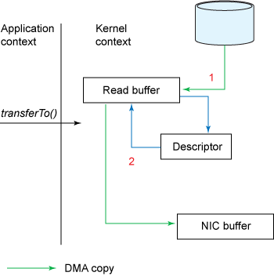

> Efficient data transfer through zero copy
>
> 通过零拷贝高效传输数据
>
> https://developer.ibm.com/articles/j-zerocopy/

许多Web应用程序提供大量的静态内容，这相当于从磁盘读取数据并将完全相同的数据写回响应套接字。此活动可能看起来需要相对较少的 CPU 活动，但它在某种程度上是低效的：内核从磁盘读取数据并将其跨内核用户边界推入应用程序，然后应用程序将其跨内核用户边界推回以写入套接字。实际上，应用程序充当了一个低效的中介，将数据从磁盘文件传输到套接字。

每次数据遍历用户内核边界时，都必须复制数据，这会消耗CPU周期和内存带宽。幸运的是，您可以通过一种叫做**“零拷贝”**的技术来消除这些拷贝。使用零拷贝的应用程序请求内核直接将数据从磁盘文件复制到套接字，而不需要经过应用程序。零复制极大地提高了应用程序性能，并减少了内核模式和用户模式之间的上下文切换次数。

Java类库通过 `java.nio.channels.FileChannel` 中的 `transferTo()` 方法在 Linux 和 UNIX 系统上支持零复制。您可以使用  `transferTo()` 方法将字节直接从调用它的通道传输到另一个可写字节通道，而不需要数据流经应用程序。本文首先演示了通过传统复制语义完成的简单文件传输所带来的开销，然后展示了使用 `transferTo()` 的零复制技术如何获得更好的性能。

# 数据传递：传统的方法

考虑从文件中读取数据并通过网络将数据传输到另一个程序的场景。（此场景描述了许多服务器应用程序的行为，包括提供静态内容的Web应用程序、FTP服务器、邮件服务器等。）

该操作的核心在**清单1**中的两个调用中——或者下载 [完整的示例代码](https://s3.us.cloud-object-storage.appdomain.cloud/developer/default/articles/j-zerocopy/static/j-zerocopy.zip)：

完整示例代码如下：

~~~java

import java.net.*;
import java.io.*;

public class TraditionalServer {
    public static void main(String args[]) {
        int port = 2000;
        ServerSocket server_socket;
        DataInputStream input;
        try {
            server_socket = new ServerSocket(port);
            System.out.println("Server waiting for client on port " + server_socket.getLocalPort());
            // server infinite loop
            while (true) {
                Socket socket = server_socket.accept();
                System.out.println("New connection accepted " + socket.getInetAddress() + ":" + socket.getPort());
                input = new DataInputStream(socket.getInputStream());
                // print received data
                try {
                    byte[] byteArray = new byte[4096];
                    while (true) {
                        int nread = input.read(byteArray, 0, 4096);
                        if (0 == nread)
                            break;
                    }
                } catch (IOException e) {
                    System.out.println(e);
                }
                // connection closed by client
                try {
                    socket.close();
                    System.out.println("Connection closed by client");
                } catch (IOException e) {
                    System.out.println(e);
                }
            }
        } catch (IOException e) {
            System.out.println(e);
        }
    }
}

public class TraditionalClient {
    public static void main(String[] args) {
        int port = 2000;
        String server = "localhost";
        Socket socket = null;
        String lineToBeSent;

        DataOutputStream output = null;
        FileInputStream inputStream = null;
        int ERROR = 1;
        // connect to server
        try {
            socket = new Socket(server, port);
            System.out.println("Connected with server " + socket.getInetAddress() + ":" + socket.getPort());
        } catch (UnknownHostException e) {
            System.out.println(e);
            System.exit(ERROR);
        } catch (IOException e) {
            System.out.println(e);
            System.exit(ERROR);
        }
        try {
            String fname = "sendfile/NetworkInterfaces.c";
            inputStream = new FileInputStream(fname);
            output = new DataOutputStream(socket.getOutputStream());
            long start = System.currentTimeMillis();
            byte[] b = new byte[4096];
            long read = 0, total = 0;
            while ((read = inputStream.read(b)) >= 0) {
                total = total + read;
                output.write(b);
            }
            System.out.println("bytes send--" + total + " and totaltime--" + (System.currentTimeMillis() - start));
        } catch (IOException e) {
            System.out.println(e);
        }
        try {
            output.close();
            socket.close();
            inputStream.close();
        } catch (IOException e) {
            System.out.println(e);
        }
    }
}
~~~

## 清单1. 将字节从文件复制到套接字

~~~java
File.read(fileDesc, buf, len); 
Socket.send(socket, buf, len);
~~~

虽然清单1在概念上很简单，但是在内部，复制操作需要在用户模式和内核模式之间进行四次上下文切换，并且在操作完成之前复制数据四次。图1 显示了数据如何在内部从文件移动到套接字：

**图1. 传统的数据复制方法**

图2 显示了上下文切换：

**图2. 传统的上下文切换**

所涉及的步骤如下：

1. `read()` 调用导致上下文从用户模式切换到内核模式（参见图2）。内部发出 `sys_read()` （或等效函数）来从文件中读取数据。第一次复制（参见图1）由直接内存访问（DMA）引擎执行，它从磁盘读取文件内容并将其存储到内核地址空间缓冲区中。
1. 请求的数据量从**读取缓冲区**复制到**用户缓冲区**，然后 `read()` 调用返回。调用的返回导致另一次上下文切换，从内核模式切换回用户模式。
1. `send()` 套接字调用导致上下文从用户模式切换到内核模式。执行**第三次复制**以再次将数据放入**内核地址空间缓冲区**。但这一次，数据被放入与目标**套接字相关联的另一个缓冲区**中。
1. `send()` 系统调用返回，创建第四个上下文切换。当 DMA 引擎将数据从内核缓冲区传递到协议引擎时，会独立地、异步地进行第四次复制。

使用中间内核缓冲区（而不是直接将数据传输到用户缓冲区）似乎效率很低。但是为了提高性能，在进程中引入了中间内核缓冲区。在读端使用中间缓冲区允许内核缓冲区充当“预读缓存”，当应用程序没有要求内核缓冲区保存那么多数据时。当请求的数据量小于内核缓冲区大小时，这将显著提高性能。写端的中间缓冲区允许写操作异步完成。

不幸的是，如果请求的数据的大小远远大于内核缓冲区的大小，这种方法本身就会成为性能瓶颈。在最终交付给应用程序之前，数据在磁盘、内核缓冲区和用户缓冲区之间被复制多次。

零拷贝通过消除这些冗余的数据拷贝来提高性能。

# 数据传递：零拷贝方法

如果您重新检查传统场景，您将注意到实际上并不需要第二个和第三个数据副本。应用程序只是缓存数据并将其传输回套接字缓冲区。相反，数据可以直接从读缓冲区传输到套接字缓冲区。`transferTo()` 方法可以让你做到这一点。清单2 显示了 `transferTo()` 的方法签名：

## 清单 2. transferTo() 方法

~~~java
public void transferTo(long position, long count, WritableByteChannel target);
~~~

`transferTo()` 方法将数据从文件通道传输到给定的可写字节通道。在内部，它取决于底层操作系统对零拷贝的支持；在 UNIX 和各种类型的 Linux 中，这个调用被路由到 `sendfile()` 系统调用，如**清单3**所示，它将数据从一个文件描述符传输到另一个文件描述符：

## 清单 3. sendfile() 方法

~~~c#
#include <sys/socket.h>
ssize_t sendfile(int out_fd, int in_fd, off_t *offset, size_t count);
~~~

清单1中 `file.read()` 和 `socket.send()` 调用的动作可以用单个 `transferTo()` 调用代替，如清单4所示：

## 清单 4. 使用 transferTo() 将数据从磁盘文件复制到套接字

~~~java
transferTo(position, count, writableChannel);
~~~

图3显示了使用 `transferTo()` 方法时的数据路径：

**图 3. 使用 transferTo() 复制数据**

图4 显示了使用 `transferTo()` 方法时的上下文切换：

**图 4. 使用 transferTo() 进行上下文切换**

在**清单4**中使用 `transferTo()` 时所采取的步骤是：

1. `transferTo()` 方法导致文件内容被DMA引擎复制到读取缓冲区中。然后，内核将数据复制到与输出套接字关联的内核缓冲区中。
2. 第三次复制发生在DMA引擎将数据从内核套接字缓冲区传递到协议引擎时。

这是一个改进：我们将上下文切换的数量从4个减少到2个，并将数据副本的数量从4个减少到3个（其中只有一个涉及CPU）。但这还没有让我们达到零复制的目标。如果底层网络接口卡支持**“收集操作”**，我们可以进一步减少内核所做的数据重复。在Linux内核2.4及更高版本中，套接字缓冲区描述符被修改以适应这一要求。这种方法不仅减少了多个上下文切换，还消除了需要CPU参与的重复数据副本。用户端的用法仍然保持不变，但本质发生了变化：

1. `transferTo()` 方法导致文件内容被DMA引擎复制到内核缓冲区中。
2. 没有数据被复制到套接字缓冲区。相反，只有包含有关数据位置和长度信息的描述符才会被附加到套接字缓冲区中。DMA引擎将数据直接从内核缓冲区传递到协议引擎，从而消除了剩余的最终CPU拷贝。

图5显示了使用 `transferTo()` 进行收集操作的数据副本：

**图 5. 当使用 transferTo() 和收集操作时，数据会复制**

# 构建文件服务器

现在让我们将零复制付诸实践，使用在客户端和服务器之间传输文件的相同示例；请参阅[完整的示例代码](https://s3.us.cloud-object-storage.appdomain.cloud/developer/default/articles/j-zerocopy/static/j-zerocopy.zip)。

`TraditionalClient.java` 和 `TraditionalServer.java` 基于传统的复制语义，使用 `File.read()` 和 `Socket.send()`。`TraditionalServer.java` 是一个服务器程序，它在一个特定的端口上监听客户端连接，然后每次从套接字读取4K字节的数据。`TraditionalClient.java` 连接到服务器，从文件中读取（使用 `file .read()`） 4K字节的数据，并通过套接字（使用 `socket.send()`）将内容发送到服务器。

类似地，`TransferToServer.java` 和 `TransferToClient.java` 执行相同的功能，但使用 `transferTo()` 方法（然后使用 `sendfile()` 系统调用）将文件从服务器传输到客户端。

~~~java
package sendfile;

import java.io.IOException;
import java.net.InetSocketAddress;
import java.net.ServerSocket;
import java.nio.ByteBuffer;
import java.nio.channels.ServerSocketChannel;
import java.nio.channels.SocketChannel;

public class TransferToServer  {
  ServerSocketChannel listener = null;
  protected void mySetup()
  {
    InetSocketAddress listenAddr =  new InetSocketAddress(9026);

    try {
      listener = ServerSocketChannel.open();
      ServerSocket ss = listener.socket();
      ss.setReuseAddress(true);
      ss.bind(listenAddr);
      System.out.println("Listening on port : "+ listenAddr.toString());
    } catch (IOException e) {
      System.out.println("Failed to bind, is port : "+ listenAddr.toString()
          + " already in use ? Error Msg : "+e.getMessage());
      e.printStackTrace();
    }

  }

  public static void main(String[] args)
  {
    TransferToServer dns = new TransferToServer();
    dns.mySetup();
    dns.readData();
  }

  private void readData()  {
	  ByteBuffer dst = ByteBuffer.allocate(4096);
	  try {
		  while(true) {
			  SocketChannel conn = listener.accept();
			  System.out.println("Accepted : "+conn);
			  conn.configureBlocking(true);
			  int nread = 0;
			  while (nread != -1)  {
				  try {
					  nread = conn.read(dst);
				  } catch (IOException e) {
					  e.printStackTrace();
					  nread = -1;
				  }
				  dst.rewind();
			  }
		  }
	  } catch (IOException e) {
		  e.printStackTrace();
	  }
  }
}

package sendfile;

import java.io.File;
import java.io.FileInputStream;
import java.io.IOException;
import java.net.InetSocketAddress;
import java.net.SocketAddress;
import java.nio.channels.FileChannel;
import java.nio.channels.SocketChannel;

public class TransferToClient {
	
	public static void main(String[] args) throws IOException{
		TransferToClient sfc = new TransferToClient();
		sfc.testSendfile();
	}
	public void testSendfile() throws IOException {
	    String host = "localhost";
	    int port = 9026;
	    SocketAddress sad = new InetSocketAddress(host, port);
	    SocketChannel sc = SocketChannel.open();
	    sc.connect(sad);
	    sc.configureBlocking(true);

	    String fname = "sendfile/NetworkInterfaces.c";
	    long fsize = 183678375L, sendzise = 4094;
	    
	    // FileProposerExample.stuffFile(fname, fsize);
	    FileChannel fc = new FileInputStream(fname).getChannel();
    	long start = System.currentTimeMillis();
	    long nsent = 0, curnset = 0;
	    curnset =  fc.transferTo(0, fsize, sc);
	    System.out.println("total bytes transferred--"+curnset+" and time taken in MS--"+(System.currentTimeMillis() - start));
	    //fc.close();
	  }
}
~~~

# 性能比较

我们在运行2.6内核的 Linux 系统上执行示例程序，并测量了不同大小的传统方法和 `transferTo()` 方法的运行时间（以毫秒为单位）。

结果如表1所示：

**表 1. 性能比较：Traditional approach vs. zero copy**

| File size | Normal file transfer (ms) | transferTo (ms) |
| :-------- | :------------------------ | :-------------- |
| 7MB       | 156                       | 45              |
| 21MB      | 337                       | 128             |
| 63MB      | 843                       | 387             |
| 98MB      | 1320                      | 617             |
| 200MB     | 2124                      | 1150            |
| 350MB     | 3631                      | 1762            |
| 700MB     | 13498                     | 4422            |
| 1GB       | 18399                     | 8537            |

如您所见，与传统方法相比，`transferTo()` API缩短了大约65%的时间。对于需要将大量数据从一个 I/O 通道复制到另一个 I/O 通道的应用程序（例如Web服务器），这有可能显著提高性能。

# 总结

我们已经演示了与从一个通道读取数据并将相同的数据写入另一个通道相比，使用 `transferTo()` 的性能优势。中间缓冲区拷贝（即使是隐藏在内核中的缓冲区拷贝）可能会有可测量的成本。在需要在通道之间进行大量数据复制的应用程序中，零复制技术可以显著提高性能。
