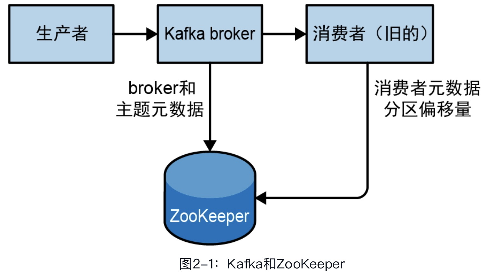

> Kafka 权威指南第二版 读书笔记

# 第一章 初识Kafka

**消息与批次：**

当需要以一种可控的方式将消息写入不同的分区时，需要用到键。

为了提高效率，消息会被分成批次写入Kafka。批次包含了一组属于同一个主题和分区的消息。

**模式：**

数据的格式

**主题与分区：**

一个主题可以包含几个分区。因此无法在整个主题范围内保证消息的顺序，但可以保证消息在单个分区内是有序的。

**生产者、消费者：**

**偏移量**

**broker 与 集群**

**保留消息**

**多集群**

MirrorMaker 的工具：可以用它将数据复制到其他集群中。

## 为什么选择 Kafka

- 多个生产者
- 多个消费者：可以分成组，消费者组与组之间不影响消费数据
- 基于磁盘的数据保留
- 伸缩性：对在线集群进行扩展丝毫不影响系统的可用性。
- 高性能：上面提到的所有特性让Kafka成了一个高性能的发布与订阅消息系统。在处理大量数据的同时，它还能保证亚秒级的消息延迟。
- 平台特性：Kafka Streams提供了一个开发库，开发人员可以用它开发具备伸缩性和容错能力的流式处理应用程序。

## 数据生态系统

**应用场景：**

- 活动跟踪
- 传递消息
- 指标和日志记录
- 提交日志
  - 可以把数据库的更新发布到Kafka，然后应用程序会通过监控事件流来接收数据库的实时更新。
- 流式处理

## 起源故事

最初建立的主要目标：

- 使用推送和拉取模型解耦生产者和消费者。
- 为消息传递系统中的消息提供数据持久化，以便支持多个消费者。
- 通过系统优化实现高吞吐量。
- 系统可以随着数据流的增长进行横向伸缩。

Kafka使用Avro作为消息序列化框架，每天可以高效处理数十亿级别的指标和用户活动跟踪信息。借助Kafka的伸缩能力，LinkedIn的消息处理量已经超过7万亿条（截至2020年2月），每天处理超过5000万亿字节的数据。

# 第二章 安装 Kafka

## 安装 Java

在安装ZooKeeper或Kafka之前，需要有一个Java运行时环境。

## 安装 ZooKeeper

Kafka 用 ZooKeeper 来保存集群元数据和消费者信息。

## 配置 broker

### 常规配置参数

**broker.id**

每个broker都需要有一个整数标识符，该标识符是使用broker.id指定的。它的默认值是0，但可以被设置成其他任意整数。这个值在整个Kafka集群中必须是唯一的，并且可以在服务器节点间移动。

**listeners**

新的listeners配置参数是一个用逗号分隔的URI列表，也就是要监听的地址和端口。如果没有为监听器指定安全协议，则还需要额外配置listener.security.protocol.map参数。监听器的格式为<protocol>://<hostname>:<port>，例如，PLAINTEXT://localhost:9092,SSL://:9091就是一个合法的配置。

**zookeeper.connect**

用于保存broker元数据的ZooKeeper地址是通过zookeeper.connect来指定的。

示例配置使用了一个运行在2181端口上的ZooKeeper，所以指定了localhost:2181。这个参数的值是用逗号分隔的一组hostname:port/path，每一部分的含义如下。

- hostname：ZooKeeper服务器的主机名或IP地址。

- port：ZooKeeper的客户端连接端口。
- /path：可选的ZooKeeper路径，以作为Kafka集群的chroot。如果不指定，则默认使用根路径。如果指定的chroot路径（一般作为应用程序的根目录）不存在，那么broker会在启动时创建它。

**log.dirs**

Kafka把所有消息都保存在磁盘上，存放日志片段的目录是通过log.dir来指定的。

如果有多个目录，则可以用log.dirs来指定。如果没有指定这个参数，则默认使用log.dir。

如果指定了多条路径，那么broker会根据“最少使用”原则，把同一个分区的日志片段保存到同一条路径下。

需要注意的是，broker会向分区数量最少的目录新增分区，而不是向可用磁盘空间最小的目录新增分区，所以并不能保证数据会被均匀地分布在多个目录中。

**num.recovery.threads.per.data.dir**

Kafka使用线程池来处理日志片段。

目前，线程池被用于以下3种情形。

- 当服务器正常启动时，用于打开每个分区的日志片段。
- 当服务器发生崩溃并重启时，用于检查和截短每个分区的日志片段。
- 当服务器正常关闭时，用于关闭日志片段。

需要注意的是，这个参数对应的是log.dirs中的一个目录，也就是说，如果num.recovery.threads.per.data.dir被设为8，并且log.dirs指定了3条路径，那么总共需要24个线程。

**auto.create.topics.enable**

Kafka会在如下几种情形中自动创建主题。

- 当一个生产者开始向主题写入消息时。
- 当一个消费者开始从主题读取消息时。
- 当客户端向主题发送获取元数据的请求时。

**auto.leader.rebalance.enable**

确保主题的所有权不会集中在一台broker上。

**delete.topic.enable**

禁用主题删除功能

### 主题的默认配置

**num.partitions**

新创建的主题将包含多少个分区。可以增加主题的分区数，但不能减少。

**default.replication.factor**

新创建主题的复制系数。

**log.retention.ms**

Kafka 通常根据配置的时间长短来决定数据可以被保留多久。

使用log.retention.hours参数来配置时间，默认为168小时，也就是1周。除此以外，还有另外两个参数log.retention.minutes和log.retention.ms。

如果指定了多个参数，Kafka会优先使用具有最小单位值的那个。

**log.retention.bytes**

计算已保留的消息的字节总数来判断旧消息是否过期。这个参数针对单个分区。

如果这个值被设置为–1，那么分区就可以无限期地保留数据。

**注意：**如果同时指定了log.retention.bytes和log.retention.ms（或另一个按时间保留的参数），那么只要任意一个条件得到满足，消息就会被删除。

**log.segment.bytes**

（默认是1 GB）

当日志片段大小达到log.segment.bytes指定的上限（默认是1 GB）时，当前日志片段会被关闭，一个新的日志片段会被打开。一旦日志片段被关闭，就可以开始进入过期倒计时。这个参数的值越小，关闭和分配新文件就会越频繁，从而降低整体的磁盘写入效率。

如果一个主题每天只接收100 MB的消息，并且log.segment.bytes使用了默认设置，那么填满一个日志片段将需要10天。因为在日志片段被关闭之前消息是不会过期的，所以如果log.retention.ms被设为604 800 000（也就是1周），那么日志片段最多需要17天才会过期。这是因为关闭日志片段需要10天，而根据配置的过期时间，还需要再保留数据7天（要等到日志片段的最后一条消息过期才能将其删除）。

​	

